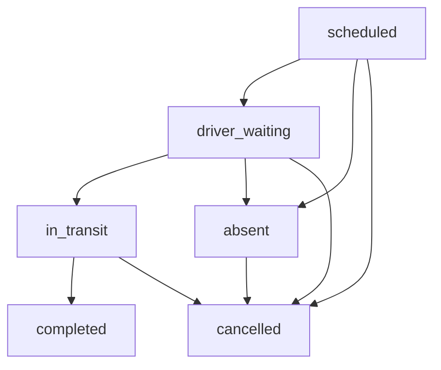
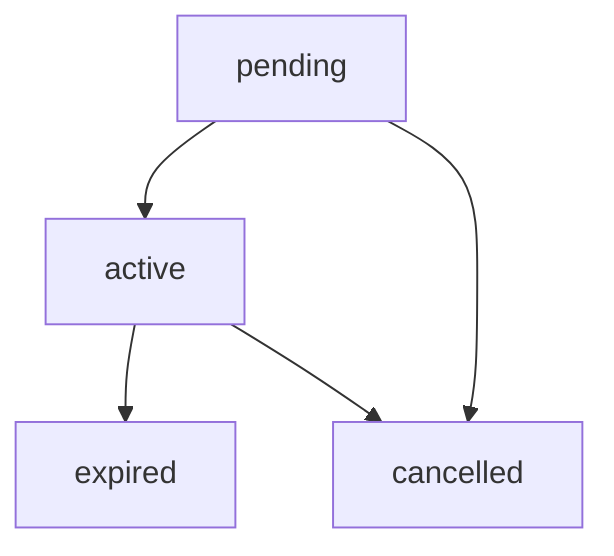

# Sair v2 - State Machine & Core Lifecycles 🔄

This document outlines the state machine rules governing the lifecycle of Trips and Subscriptions. These rules are defined in the `@sair/core` package and enforced in PostgreSQL to ensure consistency across the client, service, and database layers.

---

## 1. Trip Lifecycle State Machine

Trips track the daily journeys scheduled for each bus route. The status of a trip must evolve through a strict set of transitions.

### 1.1 Transition Validation Logic

State changes are evaluated in the database by `validate_trip_transition(p_trip_id, p_new_status)`. The allowed state transitions are:

| From State           | Allowed To States                       |
| :------------------- | :-------------------------------------- |
| **`scheduled`**      | `driver_waiting`, `absent`, `cancelled` |
| **`driver_waiting`** | `in_transit`, `absent`, `cancelled`     |
| **`in_transit`**     | `completed`, `cancelled`                |
| **`completed`**      | None (Final State)                      |
| **`absent`**         | `cancelled`                             |
| **`cancelled`**      | None (Final State)                      |

### 1.2 Important Trip Transition Rules

- **No Transit-to-Absent**: A trip that is already `in_transit` cannot transition to `absent`. It must either complete or be cancelled.
- **Emergency Cancellation**: A trip in the `in_transit` state can transition to `cancelled` in the event of an emergency (e.g., vehicle breakdown).
- **Absent-to-Cancelled**: If a driver is marked `absent` but the trip is later officially revoked, it can transition to `cancelled`.

---

## 2. Subscription Lifecycle

Subscriptions manage student seats on specific routes.

- **`pending`**: The subscription is created but not yet active (e.g., waiting for validation or start date).
- **`active`**: The student has full boarding privileges on the assigned route.
- **`expired`**: The subscription duration has lapsed.
- **`cancelled`**: The subscription was revoked by the student or an administrator.

---

## 3. Seat Allocation & Return Rules

To prevent seat balance inflation, Sair v2 decouples seat capacity from individual daily trips. **Seats belong to subscriptions, not trips.**

### 3.1 The Subscription-Seat Decoupling Rule

- **Deduction**: When a student activates a license code, 1 seat is atomically decremented from the route (`routes.available_seats`).
- **Trip Cancellation**: Cancelling a daily trip (`admin_cancel_trip`) **does not** return seats to the route. If seats were returned when a trip was cancelled, the route's available seats would exceed its physical capacity, corrupting the seat allocation model.
- **Subscription Cancellation/Expiry**: Seats are only returned to the route when:
  1. The subscription is explicitly cancelled via the `cancel_subscription` RPC.
  2. The subscription is marked `expired` by the hourly `expire-subscriptions` `pg_cron` job.
  3. A subscription record is deleted (handled by the `on_subscription_cancel` database trigger).
