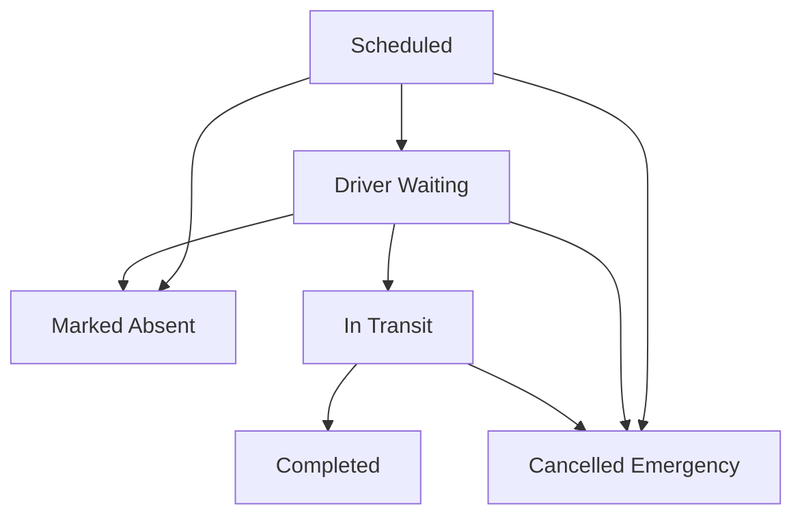
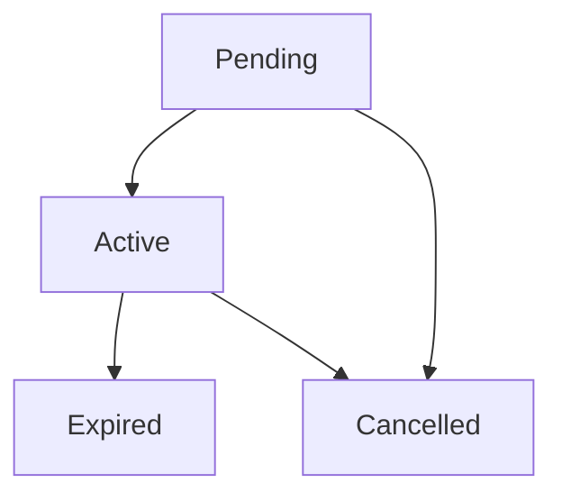

# 🔄 State Machine & Core Logic

Sair relies on strict state machines to manage the lifecycle of Trips and Subscriptions. This document outlines the allowed transitions. These transitions are defined in `@sair/core` and rigorously enforced by database triggers/RPCs.

## 1. Trip Status Lifecycle

Trips move through a strict state machine managed by the `trip-engine` Edge Function and database constraints.

### Transition Rules:

- `scheduled` -> `driver_waiting`: Requires the driver to be physically near the start location (GPS verified).
- `scheduled` -> `absent`: Used if the driver does not show up at all.
- `driver_waiting` -> `in_transit`: Initiates the journey. All students not checked-in are marked absent.
- `in_transit` -> `completed`: Requires the driver to be at the destination (GPS verified).
- `*` -> `cancelled`: A trip can be cancelled from any state (including `in_transit` for emergencies), but requires proper auditing and updates. Note: Transitioning from `in_transit` to `absent` is strictly invalid.

## 2. Subscription Lifecycle

### The Atomic Licensing Flow

When a student activates a license, the following happens _atomically_:

1. **Lock**: The license row is locked (`FOR UPDATE NOWAIT`).
2. **Check**: Is `status == 'active'`?
3. **Mutate**: `status = 'used'`.
4. **Insert**: Subscription is created as `Active` for the associated route.
5. **Unlock**: Transaction commits.

If any step fails, the entire transaction rolls back. This system replaces the legacy direct seat booking/reservation logic to guarantee financial and seat consistency.
