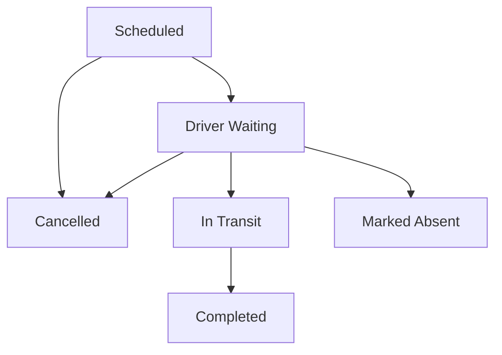
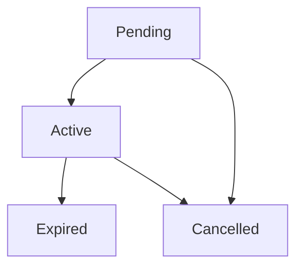

# 🔄 State Machine & Core Logic

UniRide relies on strict state machines to manage the lifecycle of Trips and Subscriptions. This document outlines the allowed transitions.

## 1. Trip Status Lifecycle

Trips move through a strict, forward-only state machine managed by the `trip-engine` Edge Function.

### Transition Rules:

- `scheduled` -> `driver_waiting`: Requires the driver to be physically near the start location (GPS verified).
- `driver_waiting` -> `in_transit`: Initiates the journey. All students not checked-in are marked absent.
- `in_transit` -> `completed`: Requires the driver to be at the destination (GPS verified).

## 2. Subscription Lifecycle

### The Atomic Booking Flow

When a student requests a route, the following happens _atomically_:

1. **Lock**: The route row is locked (`FOR UPDATE`).
2. **Check**: Is `available_seats > 0`?
3. **Mutate**: `available_seats -= 1`.
4. **Insert**: Subscription is created as `Active`.
5. **Unlock**: Transaction commits.

If any step fails, the entire transaction rolls back, guaranteeing zero overbooking.
